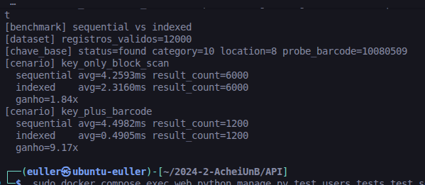
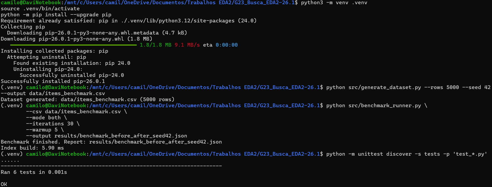

# AcheiUnB

**Número da Lista**: 1<br>
**Conteúdo da Disciplina**: Busca<br>

## Alunos
| Matrícula | Aluno |
| -- | -- |
| 23/1011220  |  Davi Camilo Menezes |
| 23/1026714  |  Euller Júlio da Silva |

## Sobre
O [AcheiUnB](https://github.com/unb-mds/2024-2-AcheiUnB) é um projeto criado para facilitar a busca e a recuperação de itens perdidos na Universidade de Brasília, permitindo que estudantes cadastrem objetos, perdidos ou encontrados, em uma plataforma mais organizada e acessível do que grupos de mensagens informais.

Este trabalho tem como objetivo aprimorar o processo de busca por meio de uma estrutura de índice primário e secundário, baseada no conceito de busca sequencial indexada. A ideia é organizar os itens por uma chave composta `status + categoria + local`, formando blocos de registros. Dentro desses blocos, os itens ficam ordenados por `barcode` ou `data`, permitindo aplicar busca binária, tornando a pesquisa mais rápida e eficiente.

## Screenshots
A seguir estão imagens do projeto em funcionamento.

### Comparação de evolução



Resultado atual medido no projeto AcheiUnB (registros reais), seguindo o benchmark (descrito com maior detalhe no tópico de uso do trabalho):

- Dataset analisado: 12000 registros válidos
- Chave base do benchmark: status=found, category=10, location=8
- Testes de núcleo executados: 6 testes, status OK

#### Tabela comparativa

| Cenário (descrição intuitiva) | Sequential avg (ms) | Indexed avg (ms) | Ganho (x) |
| --- | ---: | ---: | ---: |
| Busca por chave composta (key_only_block_scan) | 4.2593 | 2.3160 | 1.84x |
| Busca por chave composta + barcode exato (key_plus_barcode) | 4.4982 | 0.4905 | 9.17x |

Leitura rápida dos cenários:

- Busca por chave composta: filtra por status + categoria + local e analisa o bloco resultante.
- Busca por chave composta + barcode exato: aplica o mesmo filtro base e faz busca direta pelo barcode dentro do bloco.

### Execução local do trabalho



Ao fim, tem-se a validação com os testes automatizados, os quais foram concluídos com sucesso.

## Instalação
**Linguagem**: Python<br>
**Framework**: Não foi utilizado<br>
**Pré-requisitos:** Python 3.10+ instalado<br>

### Como rodar

1. Criar e ativar ambiente virtual (recomendado)

```bash
python3 -m venv .venv
source .venv/bin/activate
python -m pip install --upgrade pip
```

2. Gerar dataset CSV

```bash
python src/generate_dataset.py --rows 5000 --seed 42 --output data/items_benchmark.csv
```

3. Rodar benchmark (sequencial x indexado)

```bash
python src/benchmark_runner.py \
	--csv data/items_benchmark.csv \
	--mode both \
	--iterations 30 \
	--warmup 5 \
	--output results/benchmark_before_after_seed42.json
```

4. Rodar testes do núcleo

```bash
python -m unittest discover -s tests -p 'test_*.py'
```

Se `python` não estiver disponível no seu terminal, use `python3` nos comandos acima.

## Uso
Para este projeto de EDA2, o uso principal do núcleo está no fluxo de validação:

1. Gerar base controlada para experimento
2. Medir desempenho antes/depois no mesmo cenário
3. Validar corretude com os testes do núcleo

Esse fluxo é o que melhor representa o objetivo do trabalho, pois evidencia o ganho da busca indexada em relação à busca sequencial (como demonstrado na screenshot de comparação de evolução).

### Modos de benchmark

- `--mode sequential`: referencia "antes" (varredura global)
- `--mode indexed`: referencia "depois" (índice + bloco + binária/fallback)
- `--mode both`: gera comparação direta no mesmo arquivo

## Outros
Este repositório não representa o projeto AcheiUnB em si, mas sim o núcleo desacoplado desenvolvido para a disciplina de Estruturas de Dados 2. Sua função é concentrar a implementação da estrutura de busca e indexação de forma separada, facilitando testes, análise e evolução da solução. A integração desse núcleo ao fluxo real do AcheiUnB já foi realizada no repositório do projeto através do seguinte Pull Request:

[Link para o PR de integração](https://github.com/unb-mds/2024-2-AcheiUnB/pull/313)
